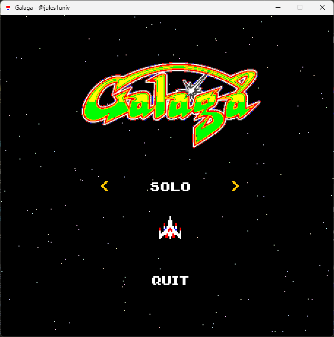

# 🎮 Galaga

   [](https://github.com/jules1univ/Galaga/actions/workflows/build-jar.yml)

> Preview 🎥


|                                              |                                             |
| -------------------------------------------- | ------------------------------------------- |
|  |  |


## 🛠️ Features

- **Player Mechanics**: Control your spaceship, shoot bullets, and dodge enemies.
- **Enemy Types**: 
    - Bees: Move in zig-zag patterns.
    - Butterflies: Move straight downwards.
    - Moths: Follow the player and trys to capture it.
    - **Bosses**: Not implemented yet.
- **Level Progression**: 
    - **Default Levels**: Predefined levels with increasing difficulty.
        - Level 1: Basic enemy waves.
        - Level 2: Increased enemy speed and frequency and intoduction of Moth enemies.
        - Level 3: Introduction of Boss enemies.
    - **Custom Levels**: Create and load your own levels.
- **Ship Skins**: Choose from various spaceship designs.
- **Sound Effects**: Original sound effects from the classic game.
- **High Scores**: Track and beat your best scores.


## 🤝 Get Involved

**🌐 Clone the repository**

```bash
git clone https://github.com/jules1univ/Galaga.git
```

Welcome to the community! We are thrilled to have you here. If you'd like to contribute:

1. Fork the repository.
2. Make your changes.
3. Submit a pull request 🔥.


## 📃 License

This project is licensed under the terms of the [MIT license](LICENSE).
