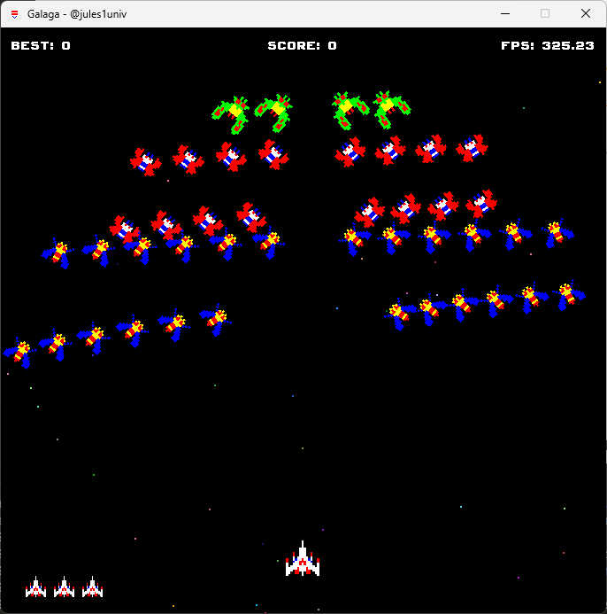

# 🎮 Galaga

  

**Concept**: A simple yet engaging Galaga clone written in Java. This project is a tribute to the classic arcade game, bringing its charm to modern platforms.

> Preview 🎥

|                                              |                                             |
| -------------------------------------------- | ------------------------------------------- |
|  |  |


## 🚀 Project Insight

- **Classic Gameplay**: Relive the thrill of space battles with waves of enemies.
- **Modern Enhancements**: Smooth animations, responsive controls, and scalable graphics.
- **Cross-Platform Compatibility**: Java-based, runs seamlessly on Windows, Linux, and MacOS.


## 🛠️ Features

- **Player Mechanics**: Control your spaceship, shoot bullets, and dodge enemies.
- **Enemy Types**: Multiple enemy behaviors, including bees, butterflies, and moths.
- **Level Progression**: Advance through increasingly challenging levels.
- **High Scores**: Track and beat your best scores.
- **Custom Resources**: Includes sprites, fonts, and levels for a tailored experience.


## 🤝 Get Involved

**🌐 Clone the repository**

```bash
git clone https://github.com/jules1univ/Galaga.git
```

Welcome to the community! We are thrilled to have you here. If you'd like to contribute:

1. Fork the repository.
2. Make your changes.
3. Submit a pull request 🔥.


## 📃 License

This project is licensed under the terms of the [MIT license](LICENSE).
